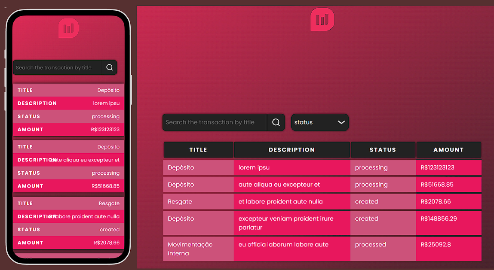
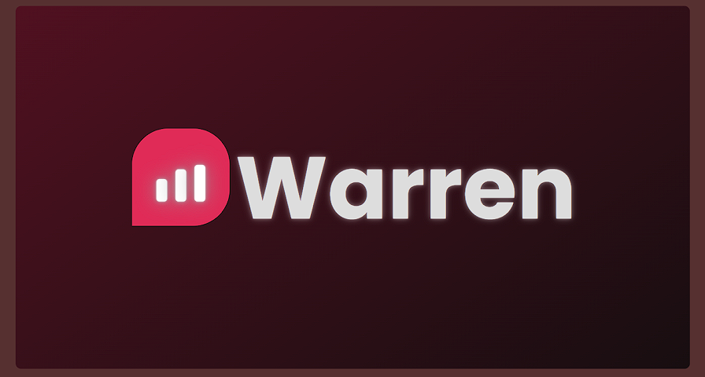

# Warren Table




Solution for Warren's frontend challange

## About project

This table was a training to boost frontend developers from the Warren, an international company of payment, link about project [Warren Project](URL_do_link)

## Installation and run

Install Node Packgage Manager in your machine [Node installation](https://nodejs.org/en/download) and run the following commands in terminal:

```
  npm install
  npm run dev
```

## Developing

This application was built in React.js and Styled-components

## Functionalaties

- Table
  - Organizing transactions by date (recent)
- Modal
  - Close and open modal
  - Show price, author and progressive
- Responsive design
- Loading screen
- Filter
  - Search by title
  - Serach by status
